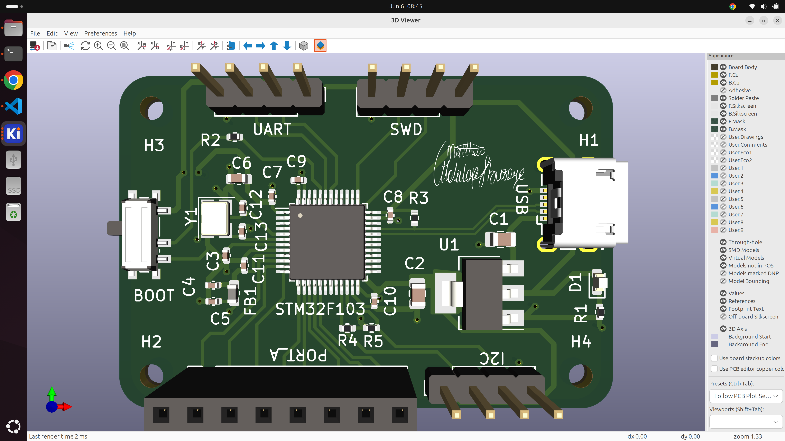
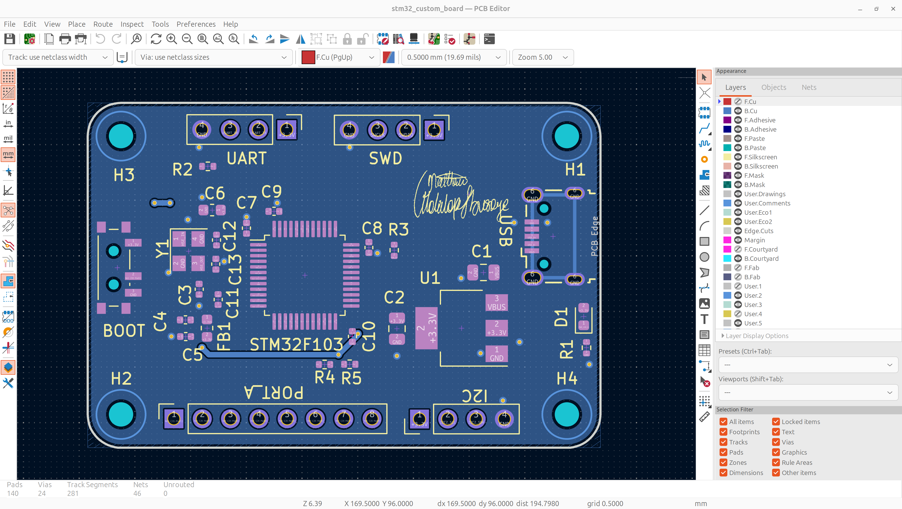

## Custom Stm32 Dev Board
This project involves the development of a custom stm32 development board based on the STM32F103C8T6 chip.

The dev board includes 
- A usb for power supply and usb 2.0 communication
- Communication breakout 
-- UART
-- I2C
- GPIO Pin break out